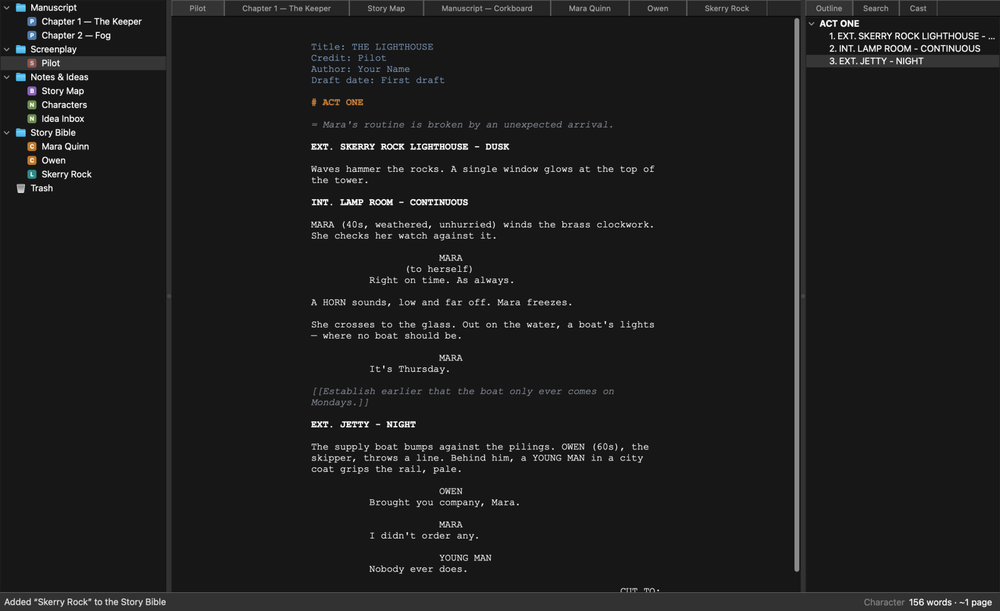
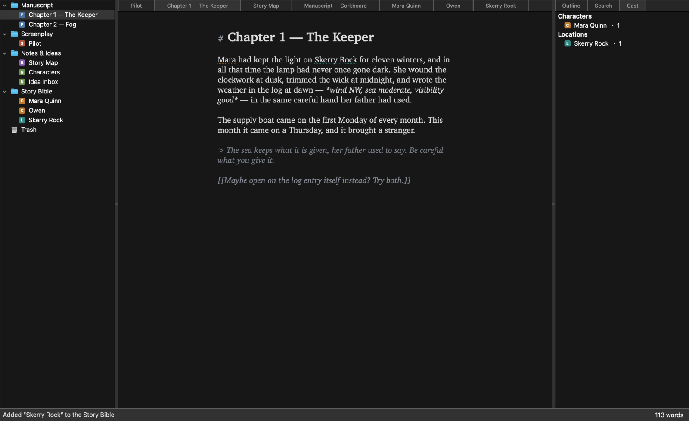

<p align="center"></p>

<h1 align="center">Screenwriter</h1>

<p align="center">A writing app for screenplays, books, notes and ideas — for macOS, Windows and Linux.</p>

<p align="center">
  <a href="https://github.com/dntAtMe/screenwriter/releases/latest"><b>Download</b></a> ·
  <a href="docs/user-guide.md">User guide</a> ·
  <a href="docs/installing.md">Installing</a> ·
  <a href="CHANGELOG.md">What's new</a>
</p>



## What it does

- **Screenplays that format themselves.** Type plain [Fountain](https://fountain.io) and it's laid out like a script page: `int` becomes `INT.`, a name in caps becomes a character cue, `cut to` becomes a transition. Character names, locations and times of day are suggested as you type.
- **Books and chapters.** A calm, centred writing column with Markdown, word counts, and chapters you can reorder in the binder.
- **A Story Bible.** Character and location sheets that know where they appear: scenes where a character speaks, how much they say, and every mention in your chapters. Names are underlined in your prose; alternative forms (nicknames, *Kacprowi* for Kacper, or `Kacpr*` for every ending) are recognised too.
- **Mind maps and corkboards.** Brainstorm on a canvas of cards, or see a folder of chapters as index cards with synopses and drag them into order.
- **Ideas, search, outline.** Capture an idea from anywhere, search the whole project, and jump through scenes or headings from the outline.
- **Export.** Industry-format screenplay PDF, Final Draft (`.fdx`), manuscript PDF and Word (`.docx`), Markdown, and board images.
- **Nothing gets lost.** Autosave, daily snapshots of every document, word-by-word comparison with earlier versions, and restore.
- **Your files stay yours.** A project is an ordinary folder of Markdown and Fountain text files — readable without the app, easy to back up or keep in git.

| | |
|---|---|
|  |  |
|  |  |

## Install

Download the file for your system from the [latest release](https://github.com/dntAtMe/screenwriter/releases/latest):

| System | File | |
|---|---|---|
| macOS (Apple Silicon) | `Screenwriter-…-macos-arm64.dmg` | open it and drag Screenwriter to Applications |
| macOS (Intel) | `Screenwriter-…-macos-intel.dmg` | when available for that release |
| Windows 10/11 | `Screenwriter-…-windows-x64-setup.exe` | or the portable `.zip` |
| Linux (x86-64) | `Screenwriter-…-linux-x86_64.AppImage` | `chmod +x` it and run; or the `.tar.gz` |

The app isn't code-signed yet, so macOS and Windows warn the first time you open it —
[Installing](docs/installing.md) shows how to get past that, step by step.

## Getting started

1. **File → New Project…**, give it a name and pick where the project folder goes.
2. Add a screenplay (`Ctrl+Alt+N`), a chapter (`Ctrl+N`), a board (`Ctrl+Alt+B`) or a character (`Ctrl+Alt+C`) — or right-click in the binder on the left.
3. Start writing. Everything saves automatically.

Want to look around first? Open the sample project, *The Lighthouse* — download the source (or clone the repo) and open the `examples/The Lighthouse` folder with **File → Open Project…** (copy it somewhere first if you'll edit it).

The [user guide](docs/user-guide.md) covers every feature and shortcut. On macOS, `Ctrl` in shortcuts means `⌘`.

## Contributing and building from source

Screenwriter is written in Python with Qt (PySide6). To run it from source you need [uv](https://docs.astral.sh/uv/):

```bash
git clone https://github.com/dntAtMe/screenwriter && cd screenwriter
uv run python -m screenwriter
```

See [Development](docs/development.md) for tests, packaging and how releases are made. Bug reports and ideas are welcome in [Issues](https://github.com/dntAtMe/screenwriter/issues).

The app bundles Qt and PySide6, which are available under the LGPLv3.
