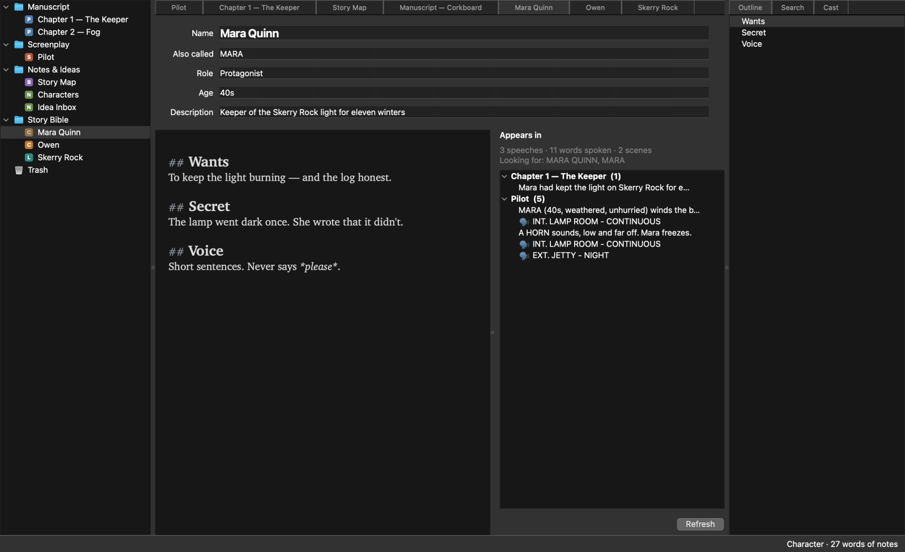
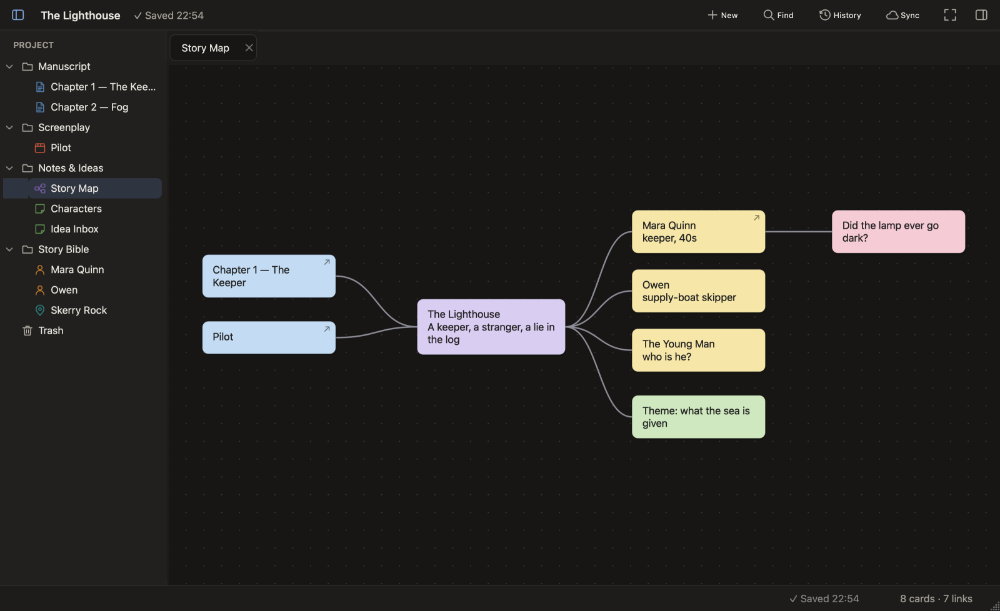
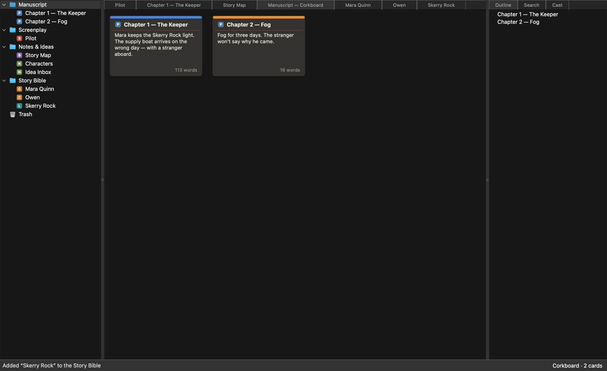
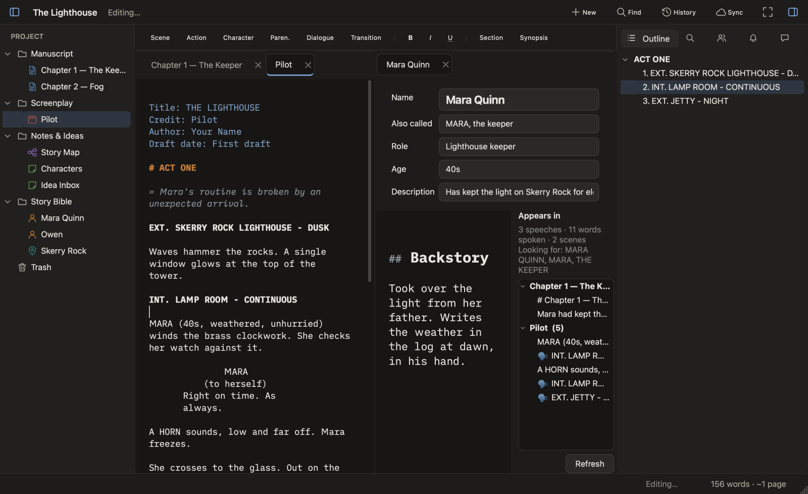

# Screenwriter user guide

On macOS, `Ctrl` in every shortcut below means `⌘` (Command), and `Alt` means `⌥` (Option).

- [Projects and the binder](#projects-and-the-binder)
- [Writing prose](#writing-prose)
- [Writing screenplays](#writing-screenplays)
- [The Story Bible](#the-story-bible)
- [Boards: mind maps](#boards-mind-maps)
- [Corkboard](#corkboard)
- [Outline, Cast, search and find](#outline-cast-search-and-find)
- [Capturing ideas](#capturing-ideas)
- [History and versions](#history-and-versions)
- [Sync, backup and sharing](#sync-backup-and-sharing)
- [Exporting](#exporting)
- [Views and focus](#views-and-focus)
- [Keyboard shortcuts](#keyboard-shortcuts)
- [How projects are stored](#how-projects-are-stored)

## Projects and the binder

A **project** is one folder holding everything for a story: chapters, scripts, notes, boards and the
Story Bible. Create one with **File → New Project…** (`Ctrl+Shift+N`) or open an existing folder with
**File → Open Project…** (`Ctrl+O`). Screenwriter reopens your last project and its tabs on start.

The **binder** on the left lists the project's contents. Each item is one of:

| Icon | Item | Used for |
|:-:|---|---|
| **P** | Prose document | chapters, scenes of a novel, articles |
| **S** | Screenplay | scripts, written in Fountain |
| **N** | Note | research, to-dos, anything else |
| **B** | Board | mind maps and free-form card layouts |
| **C** / **L** | Character / Location | Story Bible entries |
| 📁 | Folder | groups anything; double-click to see it as a corkboard |

- **Add** items from the **Insert** menu or by right-clicking in the binder. A new item goes after the
  selected one, or inside it if a folder is selected.
- **Rename**: select and press `Enter`/`F2`, or right-click → Rename.
- **Reorder / nest**: drag items. Folders and documents can both hold other items.
- **Delete**: `Delete` moves an item to the **Trash**. Items in the Trash can be dragged back out, or
  deleted permanently from there (this can't be undone).

Everything **saves automatically** a moment after you stop typing, and when you switch tabs or quit.
**File → Save** (`Ctrl+S`) saves right away if you like the habit.

## Writing prose

Prose documents and notes use [Markdown](https://commonmark.org/help/), shown as you write:

| Type | Get |
|---|---|
| `# Chapter One` | a chapter heading (`##`, `###` for smaller headings) |
| `*italic*` or `_italic_` | *italic* |
| `**bold**` | **bold** |
| `> text` | a quotation |
| `***` on its own line | a scene break |
| `[[a note to yourself]]` | an inline note — greyed out, and left out of exports |

You don't have to type the marks: the **formatting toolbar** above the page has **H1–H3**, **B**, **I**,
**Quote**, **Scene Break** and **Note**. Select text (or put the cursor on a line) and press a button; press it
again to take the formatting off. **View → Formatting Toolbar** hides or shows it.

The word count is in the status bar; select text to count just that.

## Writing screenplays

Screenplays are written in [Fountain](https://fountain.io/syntax), a plain-text screenplay format, and laid
out like a printed script as you type. You mostly just type; Screenwriter recognises what each line is and
formats it. The current element is shown in the status bar.

### Elements

| Element | How to write it |
|---|---|
| **Scene heading** | starts with `INT.`, `EXT.`, `EST.`, `INT./EXT.` or `I/E` — or force any line with a leading `.` |
| **Action** | ordinary paragraphs |
| **Character** | a name in CAPS on its own line, with dialogue right below it; extensions like `(V.O.)` are fine |
| **Parenthetical** | `(quietly)` on its own line under a character or in dialogue |
| **Dialogue** | the lines right under a character |
| **Transition** | a CAPS line ending in `TO:` (`CUT TO:`), `FADE OUT.`, or force with a leading `>` |
| **Centered** | `> THE END <` |
| **Section** | `# Act One` — for structure; shown in the outline, not printed |
| **Synopsis** | `= what happens in this scene` — not printed |
| **Note** | `[[note to yourself]]` — not printed |
| **Title page** | `Title:`, `Credit:`, `Author:`, `Draft date:`, `Contact:` lines at the very top |

Force an element when the automatic guess is wrong: a leading `!` makes a line action (`!BANG!`), and `@`
makes it a character (`@McCLANE`).

### Typing flow

- `int` or `ext` followed by a space (or `.`) becomes `INT. ` / `EXT. `; headings and transitions are capitalised.
- **Tab** on a new line after a blank line starts a **character** (it types in caps). Tab on an empty line
  inside dialogue inserts `()` for a parenthetical. Parentheses close themselves.
- **Enter** after action, dialogue or a heading starts a new paragraph (with the blank line Fountain needs);
  after a character or parenthetical it continues with dialogue. **Shift+Enter** is a plain line break.
- Typing `cut to`, `fade out` or `dissolve to` and pressing Enter makes a proper transition.
- **Ctrl+1 … Ctrl+6** turn the current line into Scene Heading, Action, Character, Parenthetical, Dialogue or
  Transition (**Format** menu), adding whatever Fountain needs.
- Or use the **formatting toolbar** above the page: the element buttons do the same as `Ctrl+1 … Ctrl+6`, and the
  current line's element is highlighted. **B**, **I**, **U** and **Note** mark the selection; **Section**,
  **Synopsis** and **Centered** change the current line. Press a button again to undo its formatting.

### Suggestions

While you type a character name, a location or a time of day, Screenwriter suggests ones already used in the
script and in the Story Bible. `↑`/`↓` to choose, `Enter`/`Tab` to accept, `Esc` to dismiss. Picking a
location in a heading goes straight on to suggest `DAY`, `NIGHT`, `CONTINUOUS`…

Undo (`Ctrl+Z`) works word by word.

## The Story Bible

The Story Bible keeps **character** and **location** sheets and connects them to your writing.



**Create** an entry with **Insert → New Character** (`Ctrl+Alt+C`) / **New Location** (`Ctrl+Alt+L`), or
straight from your writing:

- In a **script**, right-click a character cue or a scene heading → **Add “MARA” in Story Bible**
  (or **Open …** if it exists).
- Anywhere, **select a name, right-click → Add “…” to Story Bible → as a new Character / Location**.

New entries made this way go into a **Story Bible** folder in the binder.

**The form**:

- **Name** — also the item's title in the binder (renaming one renames the other).
- **Also called** — other names and forms, separated by commas: `MARA, the keeper`. Matching ignores case.
  The name itself (and a character's first name, *Mara* for *Mara Quinn*) always counts; you don't repeat it here.
  - **Inflected languages**: add each form you use (*Kacpra, Kacprowi*), or end a form with `*` to match any
    ending — `Kacpr*` finds *Kacpra, Kacprowi, Kacprem…*. Keep stems long enough to be unique (`Ma*` would also match *Mama*).
  - Quickest way: **select the form in your text, right-click → Add “Kacprowi” to Story Bible → as another name for → Kacper**.
- **Role, Age, Description** — free text. The description is shown when you hover the name and on corkboard cards.
- **Notes** — the large area below, Markdown like any prose (`## Headings` appear in the outline).

**Appears in** (right of the notes) lists where the entry shows up — scenes where a character speaks
(🗣, with the number of speeches and words spoken), mentions in scripts and chapters, and scenes set at a
location. Click a line to jump there. It refreshes when you switch to the entry, or press **Refresh**.

**In your writing**, Story Bible names are underlined with a dotted line (orange: characters, teal:
locations). Hover a name to see its description, and **Ctrl-click** (`⌘`-click) it to open the entry. Names are
suggested while you type a capitalised word, in prose as well as scripts.

### Before a character is named

A character often appears as a description first — *the hooded figure* — long before the story reveals it's
Xardas. Mark those mentions so they still count as Xardas:

- **Select the description, right-click → “the hooded figure” is… → Xardas.** Only that mention is marked;
  *the hooded figure* elsewhere can still be someone else. If the same words appear more than once in the
  document, **Every “the hooded figure” here is…** marks them all at once. Right-click a marked one to
  **Remove mark**.
- In the text it's kept as `{the hooded figure|Xardas}`: the braces and the name are shown small and grey, the
  description is underlined in the character's colour, and hovering shows who it is. Exports print just *the
  hooded figure*, and the hidden name doesn't count towards word counts.
- **In a script**, a character can speak under a description cue — `HOODED FIGURE`. Right-click the cue →
  **HOODED FIGURE in this script is… → Xardas**. This adds a note, `[[HOODED FIGURE is Xardas]]`, at the end of
  the script (notes are never printed); the cue stays as written, and those lines count as Xardas's speeches.

Marked mentions show up in the character's **Appears in** list and in the **Cast** panel like any other.

## Boards: mind maps

A **board** (`Ctrl+Alt+B`) is a canvas of cards — for brainstorming, plot maps, relationship maps.



| Do | How |
|---|---|
| New card | double-click empty space |
| Edit a card | double-click it, or select and press `F2`; `Enter` finishes, `Shift+Enter` for a new line |
| Child card (connected, to the right) | select a card, press `Tab` |
| Sibling card (below) | select a card, press `Enter` |
| Connect two cards | `Alt`+drag from one card to the other (or select two → right-click → Connect Cards) |
| Move / select several | drag cards; drag on empty space to select several |
| Colour | right-click → Color |
| Delete | select cards or links, press `Delete` |
| Pan | trackpad scroll, `Space`+drag, or middle-button drag |
| Zoom | pinch, `Ctrl`+scroll, or **View → Zoom In/Out** |

Drag documents, characters or locations **from the binder onto a board** to get cards linked to them (marked ↗);
double-click a linked card to open the document. The outline shows the board as a tree, starting from cards
nothing points to.

## Corkboard

Double-click a **folder** in the binder (or select it and press `Ctrl+Alt+K`) to see its contents as index cards.



- **Reorder** by dragging cards — the binder follows.
- **Synopsis**: click a selected card, or press `F2`, and type. `Enter` saves, `Shift+Enter` adds a line.
  Synopses also show as tooltips in the binder.
- **Open** a card with a double-click or `Enter`.
- **Right-click** for colour labels, rename, new documents in this folder, or moving to the Trash.

Cards show the word count of chapters and scripts. Character and location cards show the entry's description
until you give them a synopsis.

## Outline, Cast, search and find

The side panel on the right (**View → Toggle Side Panel**, `Ctrl+Alt+\`) has three tabs:

- **Outline** (`Ctrl+Shift+O`) — the structure of the current document: numbered scenes under their sections
  for scripts, headings for prose, cards for boards and corkboards. Click to jump; it follows your cursor.
- **Search** (`Ctrl+Shift+F`) — search the whole project (except the Trash), grouped by document; click a result
  to open it there. Tick **Aa** to match case.
- **Cast** — the characters and locations mentioned in the current document, and how often. Click to open.

**Find** in the current document with `Ctrl+F`; `Enter` for the next match, `Shift+Enter` for the previous,
`Esc` to close (`Ctrl+G` / `Ctrl+Shift+G` — `F3` / `Shift+F3` on Windows — work without the find bar too).

## Capturing ideas

Press `Ctrl+Shift+I` anywhere, type the idea, and press `Ctrl+Enter`. It's added with the date and time to the
project's **Idea Inbox** note (created if the project doesn't have one yet).

## History and versions

Screenwriter keeps the history of the **whole project** for you — every chapter, script, board and Bible
entry, and the binder itself. There's nothing to set up and nothing to learn about version control.

- **Automatic save points** are made when you open a project, every few minutes while it changes, and when
  you close it.
- **Save Version…** (`Ctrl+Alt+S`) records a named one — “Before Act 2 rewrite”, “Sent to producer”.
- **History…** (`Ctrl+Alt+H`) shows them all, newest first (named versions in bold). Show the whole project or
  only the document you're in, and hide automatic save points if you only want the named ones.

Pick a save point to see which documents it changed, then one of those documents:

| Tab | Shows |
|---|---|
| **What changed here** | what that save point changed, word by word (removed in red, added in green) |
| **Changes since, up to now** | everything that's changed in that document since then |
| **This version** | the document as it was |

**Restore This Document** puts one document back — including one you've since deleted, which returns to its
old folder. **Restore Whole Project…** puts everything back the way it was. Either way the current state is
saved as a version first (“Before restoring…”), so you can always change your mind; restoring an open document
can also be undone with `Ctrl+Z`.

History lives in a hidden `.history` folder inside the project.

## Sync, backup and sharing

### Sync through a cloud folder

To back a project up and work on it from more than one computer, keep it in sync through a cloud folder —
**Google Drive** (with Google Drive for desktop), **Dropbox**, **iCloud Drive** or **OneDrive**:

1. **File → Sync & Backup…** and pick your cloud folder (Screenwriter lists the ones it finds), or
   **Choose Another Folder…** — a USB drive works too, as a backup.
2. Screenwriter writes one file there, e.g. `Google Drive/Screenwriter/The Lighthouse.screenwriter`, holding the
   project and its whole history.
3. **On your other computer**, once the cloud folder has synced: **File → Open Project File…**, pick that file,
   choose where the project should live on that computer, and answer **Yes** to keeping it in sync.

From then on, both computers sync by themselves: when you open and close the project, every few minutes while
you write, and whenever the file in the cloud folder changes. The status bar shows **☁ Synced 14:05** (or a
problem, if the cloud folder can't be reached — usually because the cloud app isn't running).

**If both computers changed things** between syncs, Screenwriter merges them:

- documents changed on only one computer simply take that version;
- binder changes — new documents, renames, moves, synopses, labels — are combined;
- a document changed **on both** is merged paragraph by paragraph: edits to different paragraphs (or, on a board,
  different cards) simply combine;
- only when both changed **the same paragraph** differently is there a conflict. Your version stays in the
  document, and **Review Conflicts** opens (also in the **File** menu, and from **⚠ 1 conflict to review** in the
  status bar) with both versions side by side: **Keep This Version**, **Use Other Version** or **Keep Both**.
  Conflicts sync too, so whoever gets to it first can choose, and the choice is undoable like any edit;
- a document edited on one computer and deleted on the other is kept.

Nothing is ever overwritten, and every sync is in the project's history, so it can be undone from **History…**.

Keep the **project folder itself outside** the cloud folder (for example in Documents) — sync goes through the
single `.screenwriter` file. To stop, **File → Sync & Backup… → Stop Syncing**; the project stays where it is.

### Writing together

Several people can work on one project through a **shared folder** — a network drive, or a Dropbox, OneDrive or
Google Drive folder you've shared. Each of you sets up sync with the same `.screenwriter` file (the first person
with **Sync & Backup…**, the others with **File → Open Project File…**).

- **Your name**: Screenwriter asks for it the first time you set up sync (change it with **File → Your Name…**).
  It's recorded with your changes — in **History…**, in conflicts, and in “Brought in changes from Anna”.
- **Who's here**: the status bar lists everyone else who has the project open, each with their own colour; hover
  for what they're looking at. In the binder, a coloured initial marks the documents others have open.
- **The same document**: when someone else has the document in front of you open too, a note above the page says
  so. You can keep writing — different paragraphs merge, and if you both change the same paragraph you'll choose
  which version to keep (see above).
- **Live editing**: on a shared folder or network drive, when others have the same chapter or script open you
  see their typing within a second or two, and the paragraph each of them is in is tinted in their colour with
  their name. Everything each of you types arrives, exactly once, wherever you both are — even at the very same
  spot, where both people's letters are kept (if you type into the same word at the same moment they can end up
  mixed together; tidy up as you would anyway). What you wrote before the other person arrived is kept too.
  Their changes can't be undone from your window, so **Undo** starts afresh when they arrive. Turn it off with
  **View → Live Editing**. (It isn't available for Google Drive signed in directly, nor yet for boards and
  Story Bible entries, which still update when you sync.)
- **What's new**: when a sync brings in other people's changes, the status bar says who changed what, and those
  documents turn **bold** in the binder until you open them. The **Updates** tab in the side panel lists recent
  changes by everyone else (and by you on your other computers) — who, when, which documents and how many words —
  with the ones since you last looked in bold and counted on the tab. Double-click a document to open it, or
  **Show Changes…** to see exactly what changed in History.

While someone else has the project open, Screenwriter syncs about ten seconds after you stop typing and looks for
their changes every 15 seconds, so everyone's copy stays close and clashes stay rare. On a network drive you'll
see each other's work within half a minute or so; through a cloud service it also takes as long as that service
takes to sync. Two people saving at the same moment simply take turns.

If a cloud app ever saves a second copy of the project file — Dropbox's “(conflicted copy)”, Google Drive's
“(1)”, OneDrive's “-COMPUTERNAME” — Screenwriter merges it back in on the next sync and renames it to
`….screenwriter.merged`, which you can delete.

### Sync with Google Drive (sign in with Google)

You can also keep a project in Google Drive **without** the Google Drive app — useful on Linux, or on any
computer where you'd rather not install it:

1. **File → Sync & Backup… → Google Drive — Sign in with Google…**. Your browser opens; sign in and click
   **Allow**. Screenwriter asks only for access to *the files it creates* — it can't see anything else in your Drive.
2. The project is kept as a file in **My Drive/Screenwriter**, and syncs just like a cloud folder (merging,
   conflicts to review, and showing your other computers when they have it open).
3. **On your other computer**: **File → Open from Google Drive…**, sign in with the same account, pick the project
   and where it should live.

This is for **your own computers**: Screenwriter can only see files it created in *your* Drive, so to write
together with other people, use a shared folder instead (see *Writing together*).

Screenwriter remembers the sign-in securely (Keychain, Credential Manager or Secret Service). To sign out:
**File → Sync & Backup… → Sign Out of Google**. You can remove Screenwriter's access at any time in your
Google Account under *Security → Your connections to third-party apps & services*.

### Share a copy

**File → Share a Copy…** saves the project, with its history, as one `.screenwriter` file you can email or send.
The other person opens it with **File → Open Project File…** (and answers **No** to keeping it in sync). They get
their own copy; nothing they do changes yours.

## Exporting

Select what to export in the binder and choose **File → Export…** (`Ctrl+E`):

| Select | Formats |
|---|---|
| A screenplay | **PDF** in standard screenplay format · **Final Draft** (`.fdx`) · **Fountain** |
| A chapter or note | **PDF** · **Word** (`.docx`) · **Markdown** |
| A folder | the folder's prose documents **compiled in binder order**, as PDF, Word or Markdown |
| A board | **PNG** image or **PDF** |

- **Screenplay PDF**: Courier 12pt with industry margins and indents, a title page from the `Title:` lines,
  page numbers from page 2, scene headings never stranded at the bottom of a page, and `(MORE)` / `(CONT'D)`
  when dialogue continues on the next page. `**bold**`, `*italic*` and `_underline_` are printed as such (and kept
  in Final Draft files); write `\*` or `\_` for a plain asterisk or underscore. Letter or A4.
- **Manuscript** (PDF and Word): each `# Heading` starts a new page; Word files use standard manuscript format
  (Times 12pt, double spaced, first-line indents). A chapter without its own heading gets its title as one.
- `[[Notes]]` are never exported, and neither are a script's `# sections` and `= synopses`.

## Views and focus

- **Go to Document**: press `Shift` twice quickly (or `Ctrl+P`), type part of a name and press `Enter`. It finds
  documents, folders (opening their corkboard) and the cards on your boards; the letters only need to be in order
  (`chk` finds *Chapter 1 — The Keeper*). Open tabs are listed first, most recent at the top. Add a space to search
  by where things are too — `map lamp` finds a card about the lamp on the *Story Map*. `Shift+Enter` opens the
  pick on the other side of a split view.
- **Switch tabs** with `Ctrl+Tab` / `Ctrl+Shift+Tab` (or `Ctrl+PgDown` / `Ctrl+PgUp`); `Alt+1` … `Alt+8` go to a
  tab by position, `Alt+9` to the last one.
- **Split view**: **View → Split Right** (`Ctrl+Alt+R`) puts the current tab beside the others; **Split Down**
  (`Ctrl+Alt+D`) puts it below. Each side has its own tabs, and new documents open on the side you're working in
  (its current tab is underlined). A document is shown on one side at a time.
  - **Move Tab to Other Side** (`Ctrl+Alt+M`) and **Focus Other Side** (`F6`) move between them.
  - **Unsplit** (`Ctrl+Alt+W`) brings every tab back together; closing the last tab on one side does the same.

  

- **Focus mode** (`Ctrl+Shift+D`) hides everything but the page. Press it again to come back.
- **Full screen**: **View → Full Screen**.
- **Zoom** (`Ctrl++` / `Ctrl+-`) changes the text size of the current document.
- Hide the binder with `Ctrl+\` and the side panel with `Ctrl+Alt+\`.

## Keyboard shortcuts

**Don't memorise them**: hold `Ctrl` (`⌘` on macOS) or `Alt` for a moment and a panel lists every shortcut that
starts with the keys you're holding. Add `Shift` (or the other key) and the list narrows to those combinations;
press the key you want, or let go, and it disappears. With `Alt` it also shows the letters that open each menu.
**View → Shortcut Hints** turns this off.

| | |
|---|---|
| **Projects** | |
| New project / Open project | `Ctrl+Shift+N` / `Ctrl+O` |
| Save now / Close tab | `Ctrl+S` / `Ctrl+W` |
| Export | `Ctrl+E` |
| Save version / History | `Ctrl+Alt+S` / `Ctrl+Alt+H` |
| **New items** | |
| Prose document / Screenplay / Note | `Ctrl+N` / `Ctrl+Alt+N` / `Ctrl+Shift+J` |
| Board / Folder | `Ctrl+Alt+B` / `Ctrl+Shift+G` |
| Character / Location | `Ctrl+Alt+C` / `Ctrl+Alt+L` |
| Capture an idea | `Ctrl+Shift+I` |
| **Editing** | |
| Undo / Redo | `Ctrl+Z` / `Ctrl+Shift+Z` (`Ctrl+Y` on Windows) |
| Find / next / previous | `Ctrl+F` / `Ctrl+G` / `Ctrl+Shift+G` (`F3` / `Shift+F3` on Windows) |
| Search the project | `Ctrl+Shift+F` |
| Screenplay element | `Ctrl+1` … `Ctrl+6` |
| **View** | |
| Go to document | `Shift` `Shift` or `Ctrl+P` |
| Next / previous tab | `Ctrl+Tab` / `Ctrl+Shift+Tab` (`Ctrl+PgDown` / `Ctrl+PgUp`) |
| Tab 1–8 / last tab | `Alt+1` … `Alt+8` / `Alt+9` |
| Split right / down / unsplit | `Ctrl+Alt+R` / `Ctrl+Alt+D` / `Ctrl+Alt+W` |
| Move tab / focus the other side | `Ctrl+Alt+M` / `F6` |
| Outline / Corkboard | `Ctrl+Shift+O` / `Ctrl+Alt+K` |
| Binder / side panel | `Ctrl+\` / `Ctrl+Alt+\` |
| Focus mode | `Ctrl+Shift+D` |
| Zoom in / out | `Ctrl++` / `Ctrl+-` |

**Help → Screenplay Keys** and **Help → Board Keys** show the in-editor keys inside the app.

## How projects are stored

A project is an ordinary folder you can back up, sync or keep in git:

```
My Story/
  project.json          the binder: order, titles, synopses, labels
  docs/<id>.md          prose, notes and Story Bible entries (Markdown)
  docs/<id>.fountain    screenplays (Fountain)
  docs/<id>.board.json  boards
  .history/             the project's history (save points)
```

Files are named by a short id; the titles live in `project.json`. Every text file opens in any editor, and
`.fountain` files open in other screenwriting apps (Highland, Slugline, Fade In, Final Draft's importer…).
